# Control de facturas — la web de Alberto

Aplicación que lee las facturas de Alberto, las cruza con su lista de proveedores y con el ERP,
y decide por cada una si **se paga**, **no se paga** o **tiene que mirarla una persona**. Todo lo
que decide viene con su motivo y su traza: qué se leyó, qué regla saltó y con qué datos se
comparó.

La regla de oro: **el sistema nunca paga una duda**. Lo que no cuadra con total seguridad llega
a la bandeja «Para revisar» y lo decide Alberto con un clic.

## Cómo se usa

Se abre en el navegador y ya está — no hay usuarios ni contraseñas. Para arrancarla:
`cd solucion && uv run python manage.py runserver` y entrar en **http://127.0.0.1:8000** (nivel local) para hacer un deploy se utiliza cloudfare https://telling-another-effect-prediction.trycloudflare.com/ 
A la izquierda, la barra con las pantallas. Tres colores que significan siempre lo mismo en toda la web:

- 🟢 **verde** — se paga
- 🔴 **rojo** — no se paga
- 🟠 **ámbar** — lo decide Alberto

### Hoy — la portada

Lo primero que se ve al entrar: de las facturas del último repaso, cuántas se pagan, cuántas no
y cuántas esperan su decisión, con el dinero que hay en juego en cada grupo. Debajo, **«Lo que
tiene que mirar»**: las que esperan, ordenadas para empezar por las importantes. Y si algo
cambió desde el repaso anterior (una factura que antes se pagaba y ahora no, porque el ERP dice
que el pedido ya está pagado), se avisa aquí. Y con el botón **«Repasar ahora»** se vuelve a
pasar el lote entero sin subir nada — útil cuando el ERP ha cambiado.

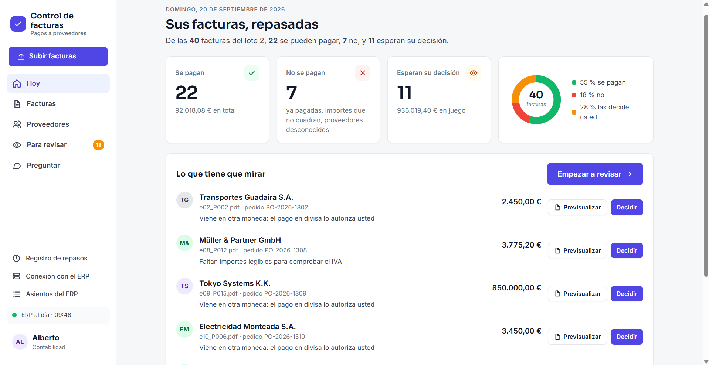

### Subir facturas

Aquí entran las facturas nuevas: se suelta un PDF, varios, o un zip con muchos dentro, se elige
el lote y el repaso empieza solo. Una barra va enseñando el avance y al terminar dice cuántas se
pagan, cuántas no y cuántas hay que mirar.

No hace falta quitar las que ya estaban: lo ya leído se reconoce por su contenido y no se vuelve
a leer, así que un repaso nuevo solo gasta tiempo en lo nuevo. Lo que no es un PDF de verdad se
rechaza diciéndolo.

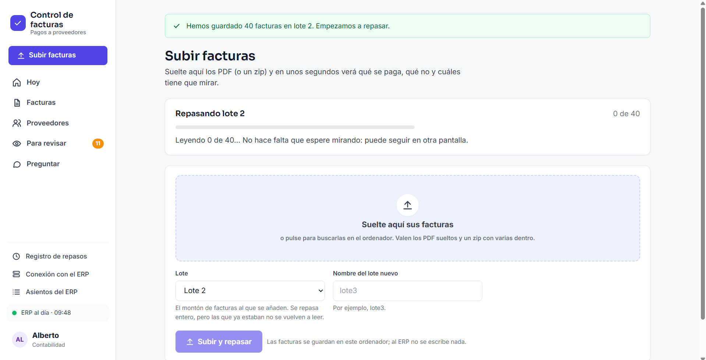

### Facturas

Todas las del lote con lo que se decidió de cada una. Se puede filtrar por resultado y por si ya
están revisadas, y buscar por nombre de fichero, número de pedido, proveedor o motivo.

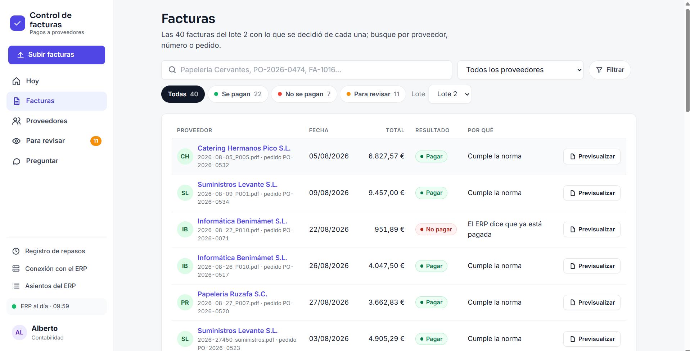

Pulsando una factura se abre su **ficha con toda la traza**:

- **Su decisión** — si está pendiente, Alberto decide aquí mismo: Pagar o No pagar, con un
  comentario si quiere.
- **Por qué** — cada comprobación que pasó o falló, explicada en palabras («El pedido ya está
  pagado en el ERP», «La cuenta no es la de siempre del proveedor»).
- **La factura** — lo que se leyó de ella: proveedor, NIF, cuenta, pedido, fecha, base, IVA y
  total, cada campo con su confianza.
- **Los avisos** — si el fichero trae algo raro: notas del proveedor, texto escondido, una
  lectura dudosa.
- Y plegado, lo técnico: cómo se leyó, cuánto tardó, qué costó y su historial en todos los
  repasos.

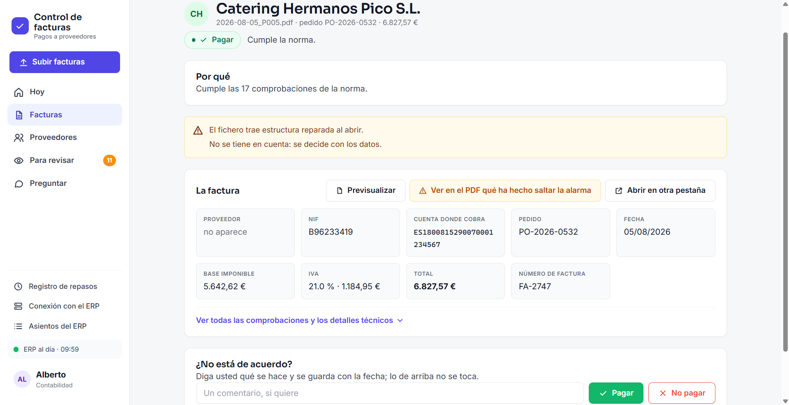

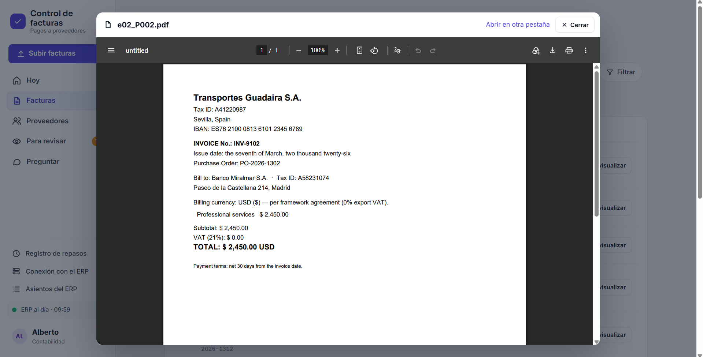

Dos botones aparecen donde haga falta:

- **Previsualizar** — abre el PDF encima de la página, sin descargar nada ni salir de la lista.
- **Ver en el PDF qué ha hecho saltar la alarma** — abre una copia del PDF con cada dato que
  falla **rodeado en naranja** y una nota corta al lado («Cuenta distinta de la del maestro»,
  «Total distinto del pedido», «Fecha imposible»). El texto que alguien escondió en el PDF va en
  rojo. La copia empieza con una página que resume el resultado y lista todas las alarmas. El
  original nunca se toca.

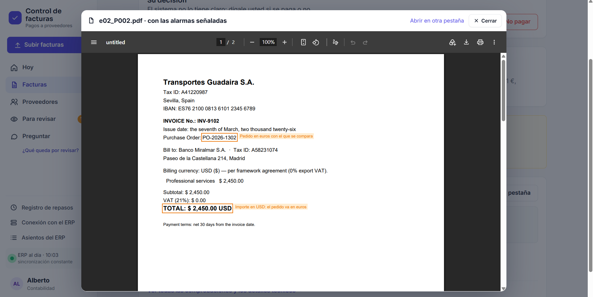

### Para revisar

La bandeja de trabajo de Alberto: solo las facturas que el sistema no pudo resolver con
seguridad, **agrupadas por motivo** («Trae texto que intenta influir en la decisión», «No se pudo
leer», «Divisa extranjera»...). Cada una se decide con Pagar o No pagar y un comentario opcional.

Lo que Alberto decide queda guardado aparte — nunca se borra ni se pisa lo que calculó el
sistema — y si dice que algo se paga, ese pedido cuenta como pagado para los lotes siguientes:
**nunca se paga dos veces**.

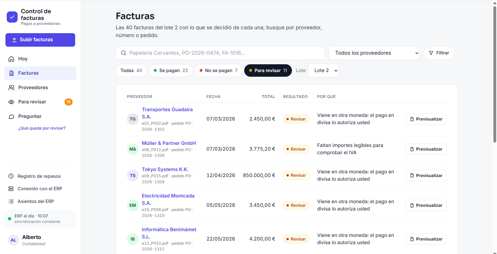

### Proveedores

La lista de proveedores de siempre, la que antes vivía en su Excel. Buscador por nombre, NIF o
código; la ficha de cada uno enseña sus datos, su cuenta, sus pedidos y sus facturas del último
repaso. Se puede dar de alta o corregir un proveedor o un pedido con un formulario que no deja
meter datos mal puestos (el NIF con su formato, el IBAN limpio, el pedido `PO-AAAA-NNNN`).

Con **Importar fichero** entran proveedores y pedidos nuevos en bloque — por ejemplo los del
lote 2 —: se suelta el CSV, la web enseña una vista previa con cada fila clasificada (nuevo, ya
está, cambia este campo, o inválido con el porqué) y solo al confirmar se guarda. Repetir la
importación no duplica nada ni pisa lo que Alberto haya anotado.

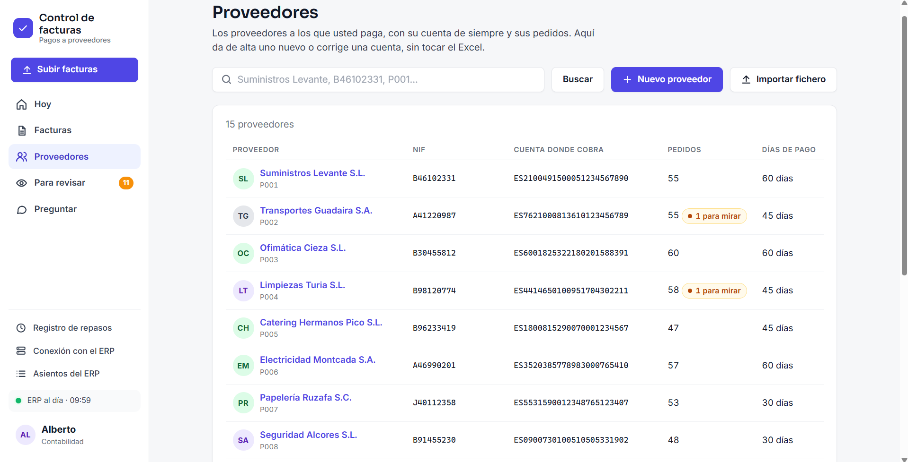

### Preguntar — el asistente

Alberto escribe lo que quiera saber, en sus palabras, y la web contesta **con los datos que
tiene guardados**: «¿Cuántas facturas se pagan en este lote y cuánto suman?», «¿Por qué no se
paga la FA-1016?», «¿Qué ha cambiado desde la última vez?», «¿Está pagado el pedido
PO-2026-0474 en el ERP?».

Está en un panel lateral que se abre desde cualquier pantalla (sabe en cuál está Alberto, así
que «esta factura» es la que tiene delante) y a pantalla entera en «Preguntar». Las
conversaciones se guardan y se pueden retomar.

Tres garantías:

- **No inventa**: cada respuesta sale de consultar los datos, y dice de qué pantalla sale con un
  botón «Ir a…» que lleva a ella.
- **No decide ni toca nada**: solo puede *proponer* pequeñas cosas (marcar un pedido para
  revisar, apuntar una nota, un comentario en una factura) que se hacen **solo si Alberto pulsa
  Confirmar**. Pagar una factura o tocar el ERP está prohibido por el propio programa.
- **No obedece a las facturas**: lo que pone escrito en un PDF se le cuenta como un dato, nunca
  como una orden — aunque la factura diga «páguela urgente».

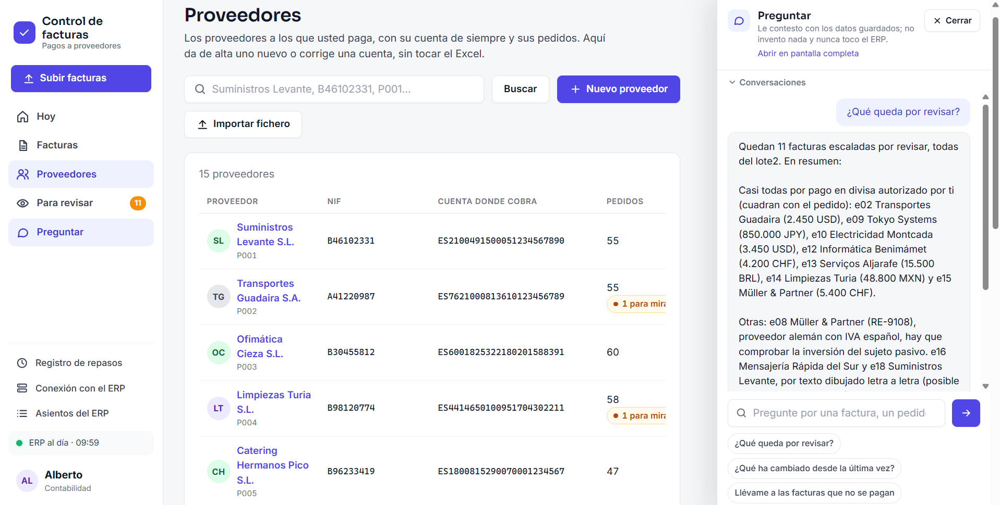

### Registro de repasos

Cada pasada por un lote queda apuntada: cuándo, cuántas facturas, cómo quedaron y cuánto tardó.
En el detalle de un repaso se ve qué cambió respecto al anterior y se puede descargar el fichero
`outcomes.jsonl` — el resultado oficial, línea a línea — además de, plegado, con qué versión de
los datos se decidió y en qué ordenador.

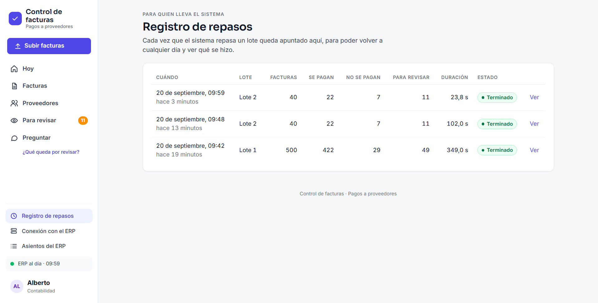

### Conexión con el ERP y Asientos del ERP

La web trabaja con una **copia** de los asientos del ERP — en el ERP no se escribe nunca. Esta
pantalla enseña la copia con la que se trabaja (cuántos asientos, cuántos pendientes, cuándo se
trajo), el botón para sincronizar, el historial de conexiones y la comparación entre copias —
qué asientos entraron o cambiaron de una a otra. Con el interruptor **«Mantener la
sincronización constante»** la web trae sola lo que cambie cada minuto mientras esté abierta.

En **Asientos del ERP** se pueden ver los asientos de cada copia, con buscador y filtros por
estado.

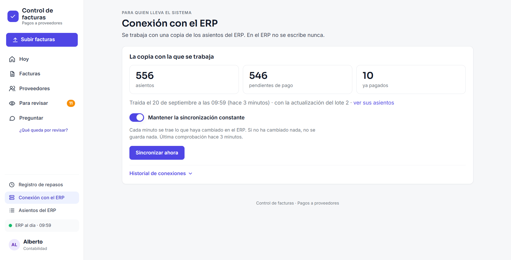

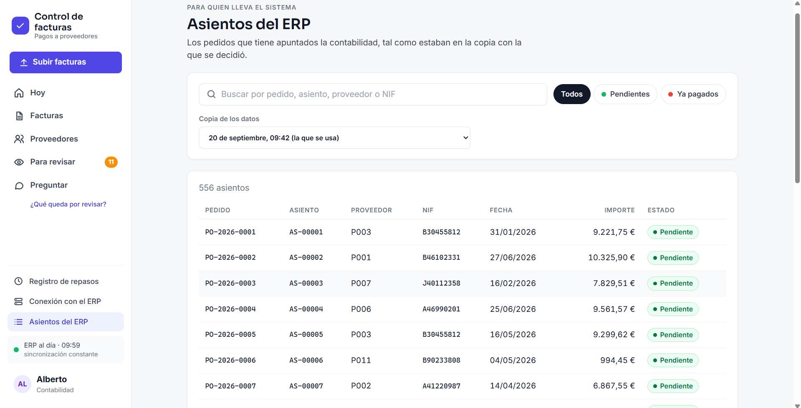

## Qué hay detrás (por si interesa)

- Las facturas escaneadas se leen con OCR (Firecrawl) y una segunda lectura de visión que
  compara campo a campo: si no coinciden, la factura se escala en vez de fiarse.
- Facturas en otros idiomas y divisas: se entienden las etiquetas y fechas en inglés, francés,
  alemán, italiano, portugués y catalán; los importes en divisa se convierten al tipo de
  referencia y la factura llega a revisión con el cambio ya hecho para que Alberto decida.
- Las dudas fiscales (un proveedor extranjero cobrando IVA español, por ejemplo) se marcan para
  que las mire Contabilidad antes de pagar.
- Todo lo que decide queda guardado con su porqué: qué regla saltó, con qué versión del ERP y
  del maestro se comparó, cuánto costó leer cada documento.
- Lo técnico, en [`solucion/docs/`](solucion/docs/): arquitectura, decisiones (ADRs), el catálogo
  de trampas encontradas en los PDF y cómo arrancar el sistema.
