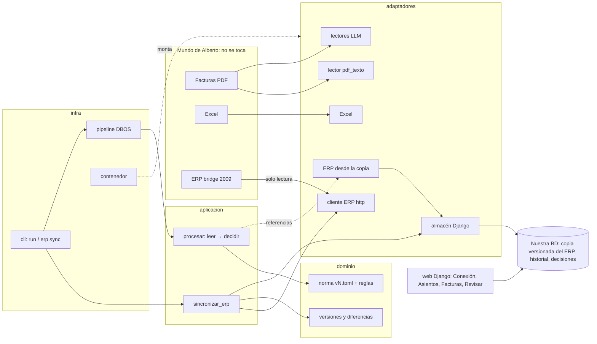

# Arquitectura

Arquitectura hexagonal (puertos y adaptadores). El dominio no sabe nada de PDFs, HTTP, LLMs,
DBOS ni Django; todo eso se enchufa desde fuera. Las fronteras las vigila `lint-imports` en la CI.

**El ERP solo se lee y solo desde un sitio.** `sincronizar_erp` lo descarga entero, lo guarda como
una versión en nuestra base de datos y registra cada conexión. Las reglas y la web leen esa copia,
nunca el bridge en vivo ([ADR-003](adr/003-erp-copia-local.md)).

| Capa | Carpeta | Puede importar | Qué hay |
|---|---|---|---|
| Dominio | `src/upistas/dominio/` | nada del proyecto | Modelos, reglas, norma, parseo de importes. Funciones puras. |
| Puertos | `src/upistas/puertos.py` | dominio, contratos | Interfaces: `Inspector` (abre un fichero con cuidado y dice qué es), `LectorDocumento`, `FuenteMaestro`, `FuenteERP`, `ClienteERP`, `AlmacenERP`, `ModeloLenguaje`. |
| Aplicación | `src/upistas/aplicacion/` | dominio, puertos | Casos de uso. Reciben los adaptadores ya montados. |
| Adaptadores | `src/upistas/adaptadores/` | todo lo anterior | Implementaciones: PDF, Excel, cliente del ERP, copia del ERP, Helmcode, persistencia en Django... |
| Infra | `src/upistas/infra/` | todo | DBOS, montaje (`contenedor.py`), CLI. |
| Web | `web/` | aplicación e infra | Django: panel y bandeja de revisión. |

Los datos cruzan los bordes como **contratos** (`contracts/*.schema.json`, modelos Pydantic
generados) y dentro del dominio como dataclasses propias.

## Cómo añadir cosas

**Una regla de pago** → archivo nuevo en `dominio/reglas/` con `@regla("R6_lo_que_sea")` y
activarla en `normas/vN.toml`. Test en `tests/unit/`.

**Una norma nueva (v4)** → copiar `normas/v3.toml` a `v4.toml` y cambiar reglas o consecuencias.
Reprocesar: `uv run upistas run --norma v4`. Si la v4 trae una regla nueva, además el punto anterior.

**Un tipo de documento nuevo (emails, Excel de facturas...)** → un lector en
`adaptadores/lectores/` que implemente `LectorDocumento` (recibe el documento ya inspeccionado:
tipo, texto por página, huella y alertas) y añadirlo a `contenedor.lectores()`. Se prueban en orden,
del más barato al más caro; el primero que puede, gana. Dominio y reglas no cambian.

**Otro proveedor de LLM o de respaldo** → un adaptador de `ModeloLenguaje` y elegirlo en
`contenedor.py` o por `.env`.

**Otro ERP** → un adaptador de `ClienteERP` (cómo se descarga) y cambiarlo en `contenedor.py`.
La copia versionada, el historial y las reglas no cambian.

**Otra fuente de datos (una base de datos, otro Excel)** → un adaptador de `FuenteMaestro` y
cambiarlo en `contenedor.py`.

**Una pantalla del panel** → vista en `web/`, que llama a la aplicación; nunca a adaptadores.

## Reglas de oro
- Lógica de negocio solo en `dominio/`. Si un `if` decide algo de pagos fuera de ahí, está mal ubicado.
- Los `@DBOS.step` solo orquestan: toda E/S que no deba repetirse tras una caída va en un step.
- `contenedor.py` es el único sitio que conoce las clases concretas de los adaptadores.
- Tests unitarios sin red ni disco; los de integración usan fuentes en memoria (`adaptadores/fuentes/memoria.py`).
